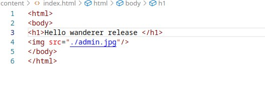

# Дипломный практикум в Yandex.Cloud
- [Дипломный практикум в Yandex.Cloud](#дипломный-практикум-в-yandexcloud)
  - [Цели:](#цели)
  - [Этапы выполнения:](#этапы-выполнения)
    - [Создание облачной инфраструктуры](#создание-облачной-инфраструктуры)
    - [Создание Kubernetes кластера](#создание-kubernetes-кластера)
    - [Создание тестового приложения](#создание-тестового-приложения)
    - [Подготовка cистемы мониторинга и деплой приложения](#подготовка-cистемы-мониторинга-и-деплой-приложения)
    - [Деплой инфраструктуры в terraform pipeline](#деплой-инфраструктуры-в-terraform-pipeline)
    - [Установка и настройка CI/CD](#установка-и-настройка-cicd)
  - [Что необходимо для сдачи задания?](#что-необходимо-для-сдачи-задания)

**Перед началом работы над дипломным заданием изучите [Инструкция по экономии облачных ресурсов](https://github.com/netology-code/devops-materials/blob/master/cloudwork.MD).**

---
## Цели:

1. Подготовить облачную инфраструктуру на базе облачного провайдера Яндекс.Облако.
2. Запустить и сконфигурировать Kubernetes кластер.
3. Установить и настроить систему мониторинга.
4. Настроить и автоматизировать сборку тестового приложения с использованием Docker-контейнеров.
5. Настроить CI для автоматической сборки и тестирования.
6. Настроить CD для автоматического развёртывания приложения.

---
## Этапы выполнения:


### Создание облачной инфраструктуры

Для начала необходимо подготовить облачную инфраструктуру в ЯО при помощи [Terraform](https://www.terraform.io/).

Особенности выполнения:

- Бюджет купона ограничен, что следует иметь в виду при проектировании инфраструктуры и использовании ресурсов;
Для облачного k8s используйте региональный мастер(неотказоустойчивый). Для self-hosted k8s минимизируйте ресурсы ВМ и долю ЦПУ. В обоих вариантах используйте прерываемые ВМ для worker nodes.

Предварительная подготовка к установке и запуску Kubernetes кластера.

1. Создайте сервисный аккаунт, который будет в дальнейшем использоваться Terraform для работы с инфраструктурой с необходимыми и достаточными правами. Не стоит использовать права суперпользователя
2. Подготовьте [backend](https://developer.hashicorp.com/terraform/language/backend) для Terraform:  
   а. Рекомендуемый вариант: S3 bucket в созданном ЯО аккаунте(создание бакета через TF)
   б. Альтернативный вариант:  [Terraform Cloud](https://app.terraform.io/)
3. Создайте конфигурацию Terrafrom, используя созданный бакет ранее как бекенд для хранения стейт файла. Конфигурации Terraform для создания сервисного аккаунта и бакета и основной инфраструктуры следует сохранить в разных папках.
4. Создайте VPC с подсетями в разных зонах доступности.
5. Убедитесь, что теперь вы можете выполнить команды `terraform destroy` и `terraform apply` без дополнительных ручных действий.
6. В случае использования [Terraform Cloud](https://app.terraform.io/) в качестве [backend](https://developer.hashicorp.com/terraform/language/backend) убедитесь, что применение изменений успешно проходит, используя web-интерфейс Terraform cloud.

Ожидаемые результаты:

1. Terraform сконфигурирован и создание инфраструктуры посредством Terraform возможно без дополнительных ручных действий, стейт основной конфигурации сохраняется в бакете или Terraform Cloud
2. Полученная конфигурация инфраструктуры является предварительной, поэтому в ходе дальнейшего выполнения задания возможны изменения.

---

С помощью основного аккаунта создаю сервисный акккаунт для дальнейшей работы, добавляем роль "editor", создаю static_access_key (Ключ доступа в bucket),создаю service_account_key ключ авторизации в клауд и создаю service_account_key_file по пути ../Diplom/main/key.json", а так же storage_bucket в котором я быду хранить .tfstate

[account](./terraform/prep/account&bucket/account.tf)

[bucket](./terraform/prep/account&bucket/account.tf)

Инициализирую backend для создаваемой инфраструктуры.

```
terraform init -backend-config="access_key=YCA******" -backend-config="secret_key=YCN****"
```
В результате получаем удаленный tfstate

[provider](./terraform/main/provider.tf)


После удаления инфрастуктуры  terraform destroy файл в бакете уменьшил свой размер что свидетельствует о коректной работе системы.


В результате кода выполненения кода в папке terraform/main была созадана сеть kub_network с 3 подсетями subnet_a subnet_b subnet_d в соответсвующих зона доступности	ru-central1.

[vps](./terraform/main/vps.tf)


Были созданы виртуальный машины master-1 node-1 node-2

[vm](./terraform/main/vm.tf)


Также после поднятия всех машины конфигурируется inventory файл в ../ansible/kubespray/inventory/mycluster/inventory.yaml для поднятия Kubernetes кластера с помощью Kubespray

[template](./terraform/main/hosts.tftpl)

---
### Создание Kubernetes кластера

На этом этапе необходимо создать [Kubernetes](https://kubernetes.io/ru/docs/concepts/overview/what-is-kubernetes/) кластер на базе предварительно созданной инфраструктуры.   Требуется обеспечить доступ к ресурсам из Интернета.

Это можно сделать двумя способами:

1. Рекомендуемый вариант: самостоятельная установка Kubernetes кластера.  
   а. При помощи Terraform подготовить как минимум 3 виртуальных машины Compute Cloud для создания Kubernetes-кластера. Тип виртуальной машины следует выбрать самостоятельно с учётом требовании к производительности и стоимости. Если в дальнейшем поймете, что необходимо сменить тип инстанса, используйте Terraform для внесения изменений.  
   б. Подготовить [ansible](https://www.ansible.com/) конфигурации, можно воспользоваться, например [Kubespray](https://kubernetes.io/docs/setup/production-environment/tools/kubespray/)  
   в. Задеплоить Kubernetes на подготовленные ранее инстансы, в случае нехватки каких-либо ресурсов вы всегда можете создать их при помощи Terraform.
2. Альтернативный вариант: воспользуйтесь сервисом [Yandex Managed Service for Kubernetes](https://cloud.yandex.ru/services/managed-kubernetes)  
  а. С помощью terraform resource для [kubernetes](https://registry.terraform.io/providers/yandex-cloud/yandex/latest/docs/resources/kubernetes_cluster) создать **региональный** мастер kubernetes с размещением нод в разных 3 подсетях      
  б. С помощью terraform resource для [kubernetes node group](https://registry.terraform.io/providers/yandex-cloud/yandex/latest/docs/resources/kubernetes_node_group)
  
Ожидаемый результат:

1. Работоспособный Kubernetes кластер.
2. В файле `~/.kube/config` находятся данные для доступа к кластеру.
3. Команда `kubectl get pods --all-namespaces` отрабатывает без ошибок.

---
Для запуска установки kubernetes кластера использую виртуальную среду с установленным ansible-core 2.18.0 и необходимыми зависимостями файла recvairmens по пути ../ansible/kubespray/recvairmens.txt

В файле inventory/mycluster/er/group_vars/k8s_cluster/k8s-cluster.yml находим параметр supplementary_addresses_in_ssl_keys: [ip-master-Nodes] и добовляю в него ip master ноды для доступа к кластеру из вне.

Командой 

```ansible-playbook -i ./inventory/mycluster/inventory.yaml cluster.yml -b -v``` 

запускаем установку Kubernetes кластер.

По зовершению установки создаем на master-1 ~/.kube и перемещаем туда /etc/kubernetes/admin.conf 

```sudo cp /etc/kubernetes/admin.conf ~/.kube/config```

Меняем владельца файла

```sudo chown -R debian:debian $HOME/.kube/config```

Копирную config на локальную машину и меняю на ip master ноды.

Командой 

``` kubectl --kubeconfig=/home/Ioan/diplomconf get nodes ```

проверяю доступность Kubernetes кластера


---
### Создание тестового приложения

Для перехода к следующему этапу необходимо подготовить тестовое приложение, эмулирующее основное приложение разрабатываемое вашей компанией.

Способ подготовки:

1. Рекомендуемый вариант:  
   а. Создайте отдельный git репозиторий с простым nginx конфигом, который будет отдавать статические данные.  
   б. Подготовьте Dockerfile для создания образа приложения.  
2. Альтернативный вариант:  
   а. Используйте любой другой код, главное, чтобы был самостоятельно создан Dockerfile.

Ожидаемый результат:

1. Git репозиторий с тестовым приложением и Dockerfile.
2. Регистри с собранным docker image. В качестве регистри может быть DockerHub или [Yandex Container Registry](https://cloud.yandex.ru/services/container-registry), созданный также с помощью terraform.
--- 

[git с Dockerfile](https://github.com/BorisHrenNakodit/nginx/tree/main)

[docker hub со сборками образа nginx](https://hub.docker.com/repository/docker/borishrennakodit/mynginx/general)

---
### Подготовка cистемы мониторинга и деплой приложения

Уже должны быть готовы конфигурации для автоматического создания облачной инфраструктуры и поднятия Kubernetes кластера.  
Теперь необходимо подготовить конфигурационные файлы для настройки нашего Kubernetes кластера.

Цель:
1. Задеплоить в кластер [prometheus](https://prometheus.io/), [grafana](https://grafana.com/), [alertmanager](https://github.com/prometheus/alertmanager), [экспортер](https://github.com/prometheus/node_exporter) основных метрик Kubernetes.
2. Задеплоить тестовое приложение, например, [nginx](https://www.nginx.com/) сервер отдающий статическую страницу.

Способ выполнения:
1. Воспользоваться пакетом [kube-prometheus](https://github.com/prometheus-operator/kube-prometheus), который уже включает в себя [Kubernetes оператор](https://operatorhub.io/) для [grafana](https://grafana.com/), [prometheus](https://prometheus.io/), [alertmanager](https://github.com/prometheus/alertmanager) и [node_exporter](https://github.com/prometheus/node_exporter). 
2. Альтернативный вариант - использовать набор helm чартов от [bitnami](https://github.com/bitnami/charts/tree/main/bitnami).


---
Устанавливаю kube-prometheus-stack с помощью helm

Добавляю репозиторий prometheus-community 

```
helm repo add prometheus-community https://prometheus-community.github.io/helm-charts
```

Скачаем и разархивируем чарт

```
helm pull prometheus-community/prometheus  
```

Создаю файл grafana.yaml и указываю там пароль для входа в grafana порт и тип сервиса

[grafana](./KPS/monitoring/grafana.yaml)


Предварительно создаю namespace monitoring и запускаю установку kube-prometheus-stack

```
helm install prometheus prometheus-community/kube-prometheus-stack --namespace monitoring -f grafana.yaml

```

По итогу получаю работающий мониторинг системы Kubernetes кластера


Деплой приложения

[nginx](./KPS/nginx/nginx.yaml)

[nginx-service](./KPS/nginx/svc-nginx.yaml)


---
### Деплой инфраструктуры в terraform pipeline

1. Если на первом этапе вы не воспользовались [Terraform Cloud](https://app.terraform.io/), то задеплойте и настройте в кластере [atlantis](https://www.runatlantis.io/) для отслеживания изменений инфраструктуры. Альтернативный вариант 3 задания: вместо Terraform Cloud или atlantis настройте на автоматический запуск и применение конфигурации terraform из вашего git-репозитория в выбранной вами CI-CD системе при любом комите в main ветку. Предоставьте скриншоты работы пайплайна из CI/CD системы.

Ожидаемый результат:
1. Git репозиторий с конфигурационными файлами для настройки Kubernetes.
2. Http доступ на 80 порту к web интерфейсу grafana.
3. Дашборды в grafana отображающие состояние Kubernetes кластера.
4. Http доступ на 80 порту к тестовому приложению.
5. Atlantis или terraform cloud или ci/cd-terraform
---
### Установка и настройка CI/CD

Осталось настроить ci/cd систему для автоматической сборки docker image и деплоя приложения при изменении кода.

Цель:

1. Автоматическая сборка docker образа при коммите в репозиторий с тестовым приложением.
2. Автоматический деплой нового docker образа.

Можно использовать [teamcity](https://www.jetbrains.com/ru-ru/teamcity/), [jenkins](https://www.jenkins.io/), [GitLab CI](https://about.gitlab.com/stages-devops-lifecycle/continuous-integration/) или GitHub Actions.

Ожидаемый результат:

1. Интерфейс ci/cd сервиса доступен по http.
2. При любом коммите в репозиторие с тестовым приложением происходит сборка и отправка в регистр Docker образа.
3. При создании тега (например, v1.0.0) происходит сборка и отправка с соответствующим label в регистри, а также деплой соответствующего Docker образа в кластер Kubernetes.
---

Был выбран GitLab переношу туда свой репозиторий с гит [gitlab](https://gitlab.com/BorisHrenNakodit/nginx)


Для сборки docker образа, отправик в docker hub и запроса на замену образа использующегося в Pods будет использоваться gitlab Pipeline

Для взаимодействия с docker hub и кластером Kubernetes были добавлены переменные 


Создаю Pipeline и делаю новый коммит


Вношу изменения в index




---
## Что необходимо для сдачи задания?

1. Репозиторий с конфигурационными файлами Terraform и готовность продемонстрировать создание всех ресурсов с нуля.
2. Пример pull request с комментариями созданными atlantis'ом или снимки экрана из Terraform Cloud или вашего CI-CD-terraform pipeline.
3. Репозиторий с конфигурацией ansible, если был выбран способ создания Kubernetes кластера при помощи ansible.
4. Репозиторий с Dockerfile тестового приложения и ссылка на собранный docker image.
5. Репозиторий с конфигурацией Kubernetes кластера.
6. Ссылка на тестовое приложение и веб интерфейс Grafana с данными доступа.
7. Все репозитории рекомендуется хранить на одном ресурсе (github, gitlab)
