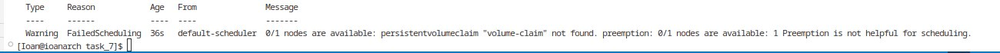
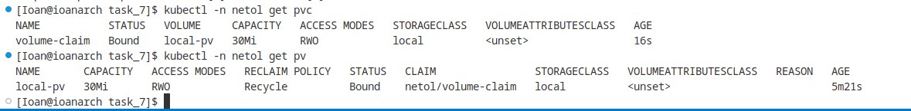
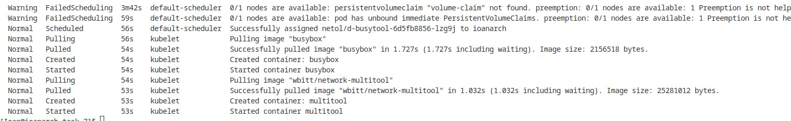
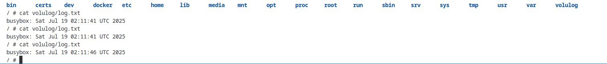
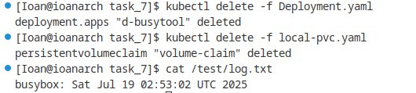
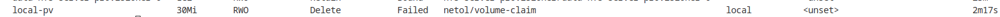
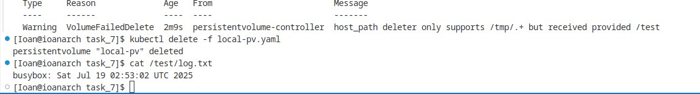
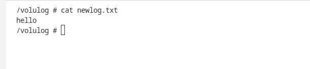
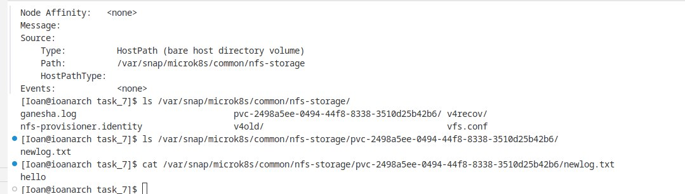

# Домашнее задание к занятию «Хранение в K8s. Часть 2»

### Цель задания

В тестовой среде Kubernetes нужно создать PV и продемострировать запись и хранение файлов.

------

### Чеклист готовности к домашнему заданию

1. Установленное K8s-решение (например, MicroK8S).
2. Установленный локальный kubectl.
3. Редактор YAML-файлов с подключенным GitHub-репозиторием.

------

### Дополнительные материалы для выполнения задания

1. [Инструкция по установке NFS в MicroK8S](https://microk8s.io/docs/nfs). 
2. [Описание Persistent Volumes](https://kubernetes.io/docs/concepts/storage/persistent-volumes/). 
3. [Описание динамического провижининга](https://kubernetes.io/docs/concepts/storage/dynamic-provisioning/). 
4. [Описание Multitool](https://github.com/wbitt/Network-MultiTool).

------

### Задание 1

**Что нужно сделать**

Создать Deployment приложения, использующего локальный PV, созданный вручную.

1. Создать Deployment приложения, состоящего из контейнеров busybox и multitool.
2. Создать PV и PVC для подключения папки на локальной ноде, которая будет использована в поде.
3. Продемонстрировать, что multitool может читать файл, в который busybox пишет каждые пять секунд в общей директории. 
4. Удалить Deployment и PVC. Продемонстрировать, что после этого произошло с PV. Пояснить, почему.
5. Продемонстрировать, что файл сохранился на локальном диске ноды. Удалить PV.  Продемонстрировать что произошло с файлом после удаления PV. Пояснить, почему.
5. Предоставить манифесты, а также скриншоты или вывод необходимых команд.

[Манифест файл Deployment](./Deployment.yaml)

[Манифест файл PV](./local-pv.yaml)

[Манифест файл PVC](./local-pvc.yaml)

persistentvolumeclaim "volume-claim" not found

Pod не стартует из-за того что не может найти pvs с подходящим именем

После создания pv и pvs Pods были созданы и запущены

Файл записанный busybox считываеться multitool

Удаляем Deployment и PVC файл остался в системе

После проверки pv было выявлено что persistentvolume-controller поддерживает только /tmp/ из-за этого файл не былы удален.
После удаления pv файл все атк же остаеться в системе.

------

### Задание 2

**Что нужно сделать**

Создать Deployment приложения, которое может хранить файлы на NFS с динамическим созданием PV.

1. Включить и настроить NFS-сервер на MicroK8S.
2. Создать Deployment приложения состоящего из multitool, и подключить к нему PV, созданный автоматически на сервере NFS.
3. Продемонстрировать возможность чтения и записи файла изнутри пода. 
4. Предоставить манифесты, а также скриншоты или вывод необходимых команд.

[Манифест файл NFS-Deployment](./dep_nfs.yaml)

[Манифест файл NFS-PVC](./nfs-pvc.yaml)

Созадаю файл в примонтированный каталог

По найденному пути на хостовой машине файл создан и имеет тоже содержание что и было задано. После удаления pvc соответствуюшйи католог в nfs-storage удаляется.
 

------

### Правила приёма работы

1. Домашняя работа оформляется в своём Git-репозитории в файле README.md. Выполненное задание пришлите ссылкой на .md-файл в вашем репозитории.
2. Файл README.md должен содержать скриншоты вывода необходимых команд `kubectl`, а также скриншоты результатов.
3. Репозиторий должен содержать тексты манифестов или ссылки на них в файле README.md.
