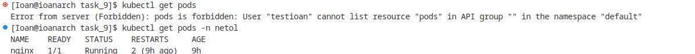

# Домашнее задание к занятию «Управление доступом»

### Цель задания

В тестовой среде Kubernetes нужно предоставить ограниченный доступ пользователю.

------

### Чеклист готовности к домашнему заданию

1. Установлено k8s-решение, например MicroK8S.
2. Установленный локальный kubectl.
3. Редактор YAML-файлов с подключённым github-репозиторием.

------

### Инструменты / дополнительные материалы, которые пригодятся для выполнения задания

1. [Описание](https://kubernetes.io/docs/reference/access-authn-authz/rbac/) RBAC.
2. [Пользователи и авторизация RBAC в Kubernetes](https://habr.com/ru/company/flant/blog/470503/).
3. [RBAC with Kubernetes in Minikube](https://medium.com/@HoussemDellai/rbac-with-kubernetes-in-minikube-4deed658ea7b).

------

### Задание 1. Создайте конфигурацию для подключения пользователя

1. Создайте и подпишите SSL-сертификат для подключения к кластеру.
2. Настройте конфигурационный файл kubectl для подключения.
3. Создайте роли и все необходимые настройки для пользователя.
4. Предусмотрите права пользователя. Пользователь может просматривать логи подов и их конфигурацию (`kubectl logs pod <pod_id>`, `kubectl describe pod <pod_id>`).
5. Предоставьте манифесты и скриншоты и/или вывод необходимых команд.


Включаем RBAC в microk8s

Создаем ключ и сертефикат пользователя
```
### генерируем ключ

openssl genrsa -out testioan.key 2048 


### генерацию запроса на сертификат

openssl req -new -key testioan.key -out test.csr -subj "/CN=testioan/O=workgroup"


### Получение сертификата пользователя при помощи ключей Certificate Authority кластера Kubernetes

openssl x509 -req -in testioan.csr -CA /var/snap/microk8s/current/certs/ca.crt -CAkey /var/snap/microk8s/current/certs/ca.key -CAcreateserial -out testioan.crt -days 365

### Привязываем нового пользователя к существующему кластеру Kubernetes

kubectl config set-credentials ioan --client-certificate=testioan.crt --client-key=testioan.key --embed-certs=true


### Добавления  context с привязкой нового пользователя

kubectl config set-context testioan --cluster=microk8s-cluster --user=testioan
```


Поумолчению никакиех прав у пользователя нет.

Создаем Role и RoleBinding

[Манифест файл Role](./role.yaml)

[Манифест файл RoleBinding](./role-binding.yaml)

Проверяем возможности в соответствии с выбранными правами




------

### Правила приёма работы

1. Домашняя работа оформляется в своём Git-репозитории в файле README.md. Выполненное домашнее задание пришлите ссылкой на .md-файл в вашем репозитории.
2. Файл README.md должен содержать скриншоты вывода необходимых команд `kubectl`, скриншоты результатов.
3. Репозиторий должен содержать тексты манифестов или ссылки на них в файле README.md.

------


