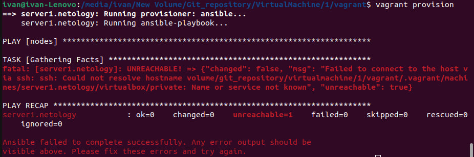
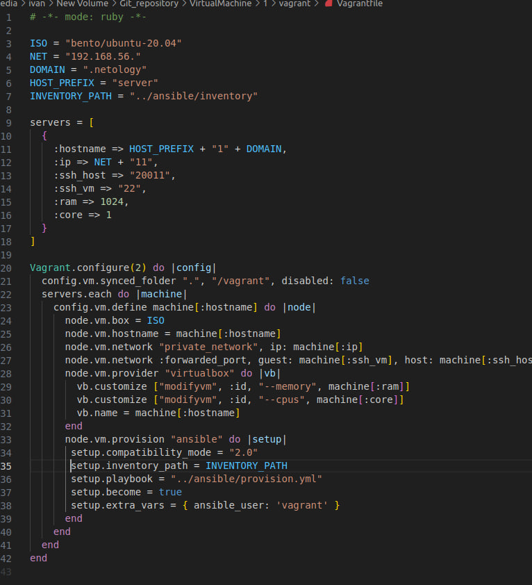
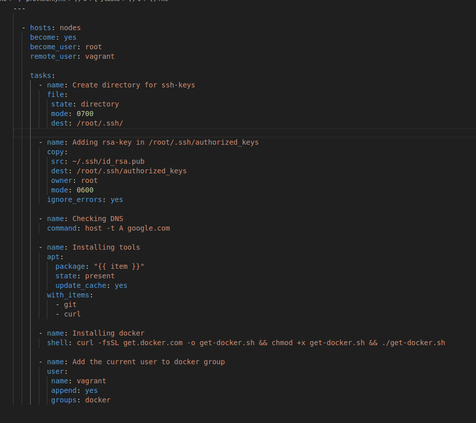
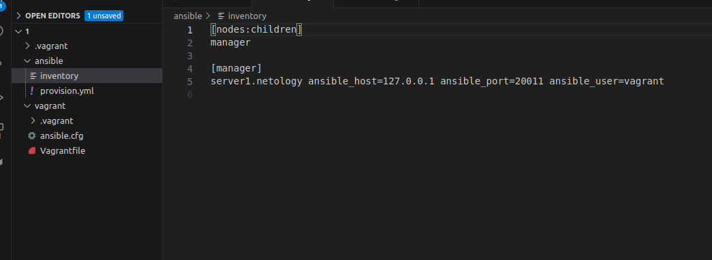

## Задание 1

Опишите основные преимущества применения на практике IaaC-паттернов.\

1. Ускорение разработки, тестирование и масштабирования продукта, а так же вывод его в конкурентную среду за счёт создаваемых шаблонов, что позволяет минимализировать рутинные процесы и заострить внимание на более сложных задачах.
2. Стабильность среды за счёт инструентов автоматического конфигурирования производиться отслеживания изменений и синхронизация остальных системам с основной.
3. Повышенная эффективность разработки ПО за счёт быстрого развертывания тестовых сред для проверки продукта, а так же автодокументирования .

Какой из принципов IaaC является основополагающим?

Стабильность, а конкретнее идемпотентность т.е. возврат одного и тогоже результата вне зависимости от колличества раз выполнения одной и тойже операции.

## Задание 2

Чем Ansible выгодно отличается от других систем управление конфигурациями?

1. Низкий порог входа
2. Отсутствие необходимости установки агентов на целевые хосты 

Какой, на ваш взгляд, метод работы систем конфигурации более надёжный — push или pull?

Я считаю что push наиболее надежный способ конфигурации, потому что получив изменения они могут быть сразу же актуализированы вне зависимости от ситуации и без ожидания запроса от целевого хоста.

## Задание 3

1. Графический интерфейс VirtualBox Версия 6.1.38_Ubuntu r153438
© 2004-2022 Oracle Corporation (Qt5.15.3)

2.  Vagrant 2.3.7

3. Terraform v1.5.6
on linux_amd64

4. ansible [core 2.15.3]  
  config file = /media/ivan/New Volume/Git_repository/VirtualMachine/1/vagrant/ansible.cfg  
  configured module search path = ['/home/ivan/.ansible/plugins/modules', '/usr/share/ansible/plugins/modules']  
  ansible python module location = /usr/local/lib/python3.10/dist-packages/ansible  
  ansible collection location = /home/ivan/.ansible/collections:/usr/share/ansible/collections  
  executable location = /usr/local/bin/ansible  
  python version = 3.10.12 (main, Jun 11 2023, 05:26:28) [GCC 11.4.0] (/usr/bin/python3)  
  jinja version = 3.1.2  
  libyaml = True  

## Задание 4
При попытки vagrant provision возникает ошибка

fatal: [server1.netology]: UNREACHABLE! => {“changed”: false, “msg”: “Failed to connect to the host via ssh: ssh: Could not resolve hostname volume/git_repository/virtualmachine/1/vagrant/.vagrant/machines/server1.netology/virtualbox/private: Name or service not known”, “unreachable”: true}

### Vagrantfile  

### provision.yml 

### Ansible.cfg 

### Inventory  
