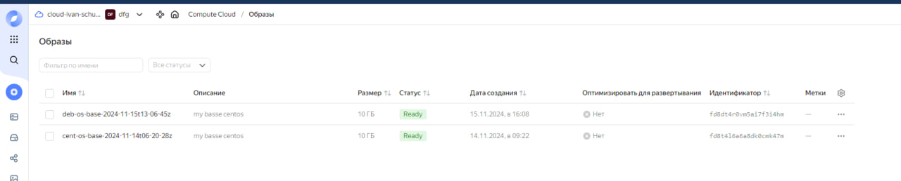
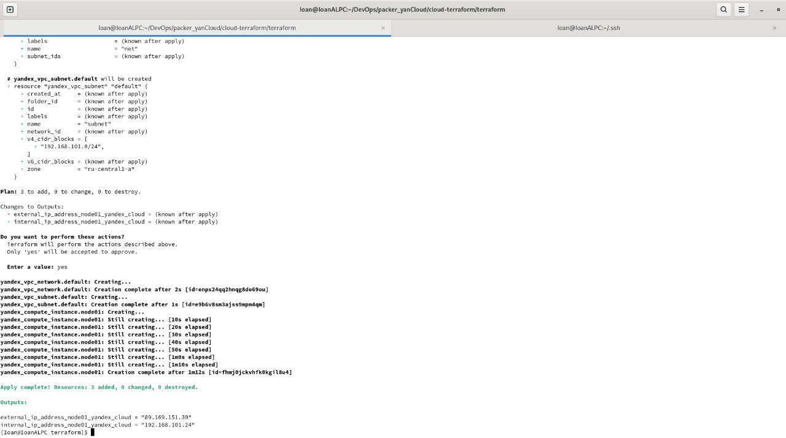
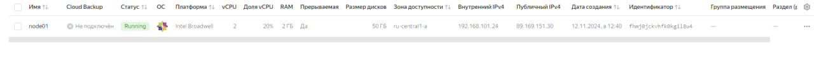
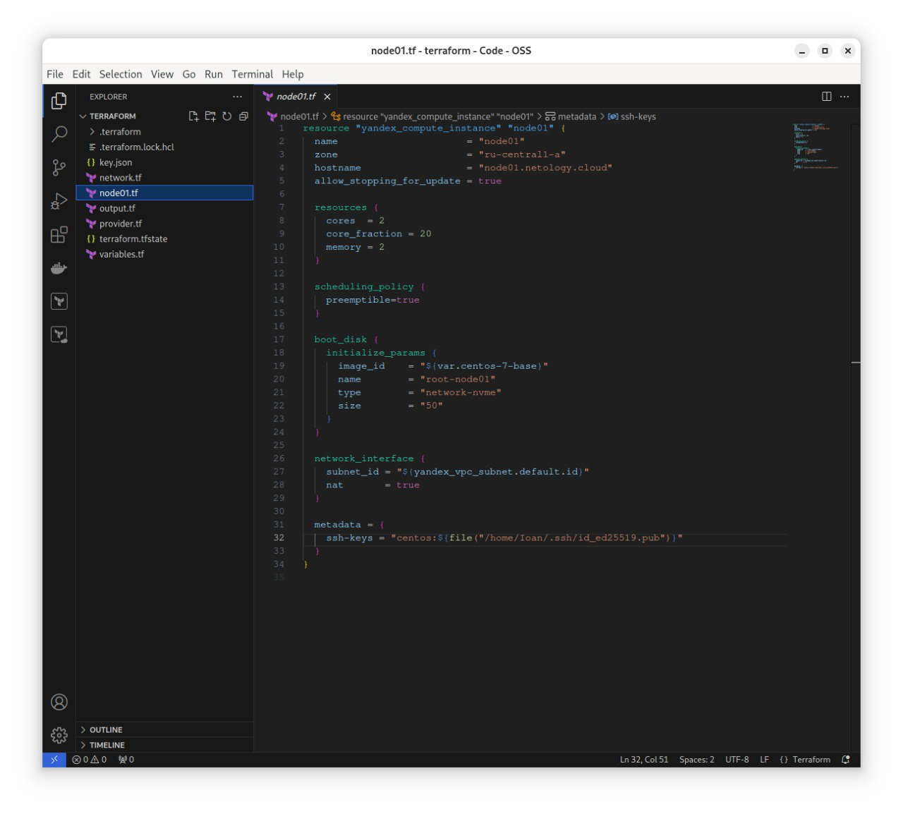
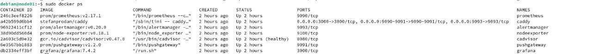
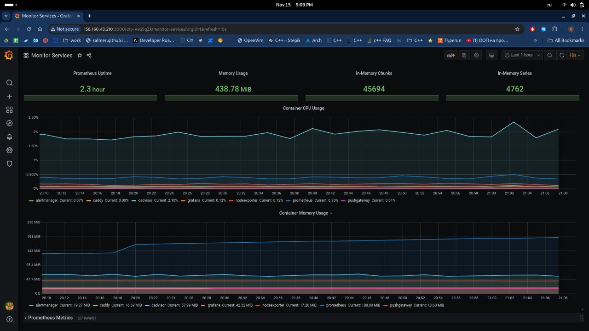
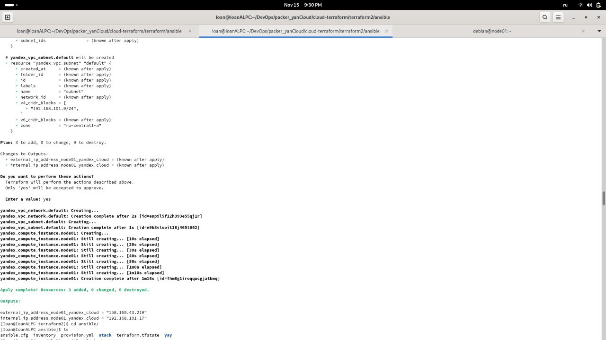

## Задача 1
Создайте собственный образ любой операционной системы (например, debian-11) с помощью Packer версии 1.7.0 . Перед выполнением задания изучите ([инструкцию!!!](https://cloud.yandex.ru/docs/tutorials/infrastructure-management/packer-quickstart)). В инструкции указана минимальная версия 1.5, но нужно использовать 1.7, так как там есть нужный нам функционал

Чтобы получить зачёт, вам нужно предоставить скриншот страницы с созданным образом из личного кабинета YandexCloud.

## Задача 2

**2.1.** Создайте вашу первую виртуальную машину в YandexCloud с помощью web-интерфейса YandexCloud.        

**2.2.*** **(Необязательное задание)**      
Создайте вашу первую виртуальную машину в YandexCloud с помощью Terraform (вместо использования веб-интерфейса YandexCloud).
Используйте Terraform-код в директории ([src/terraform](https://github.com/netology-group/virt-homeworks/tree/virt-11/05-virt-04-docker-compose/src/terraform)).

Чтобы получить зачёт, вам нужно предоставить вывод команды terraform apply и страницы свойств, созданной ВМ из личного кабинета YandexCloud.

Подкорректировал рессурсы машины и сделла ее прерываемой

## Задача 3

С помощью Ansible и Docker Compose разверните на виртуальной машине из предыдущего задания систему мониторинга на основе Prometheus/Grafana.
Используйте Ansible-код в директории ([src/ansible](https://github.com/netology-group/virt-homeworks/tree/virt-11/05-virt-04-docker-compose/src/ansible)).

Чтобы получить зачёт, вам нужно предоставить вывод команды "docker ps" , все контейнеры, описанные в [docker-compose](https://github.com/netology-group/virt-homeworks/blob/virt-11/05-virt-04-docker-compose/src/ansible/stack/docker-compose.yaml),  должны быть в статусе "Up".

## Задача 4

1. Откройте веб-браузер, зайдите на страницу http://<внешний_ip_адрес_вашей_ВМ>:3000.
2. Используйте для авторизации логин и пароль из [.env-file](https://github.com/netology-group/virt-homeworks/blob/virt-11/05-virt-04-docker-compose/src/ansible/stack/.env).
3. Изучите доступный интерфейс, найдите в интерфейсе автоматически созданные docker-compose-панели с графиками([dashboards](https://grafana.com/docs/grafana/latest/dashboards/use-dashboards/)).
4. Подождите 5-10 минут, чтобы система мониторинга успела накопить данные.

Чтобы получить зачёт, предоставьте: 

- скриншот работающего веб-интерфейса Grafana с текущими метриками, как на примере ниже.

ip не совпадает со 2 задание centos 7 конфликтует с версией python для установки через yum ему нужна версия 2.7 для скачивая репозитория, скачивая и установки docker-compose  требовалась версия 3.6 и выше по этому перехал на debian 11, как в разных частях докер файла прописать использования определенной версии python ? прописать переменную ansible_python_interpreter  и в каждом блоке где нужна другая версия питона прописывать путь до него ?

Ниже привожу вывод команды terraform apply для своего контейнера debian 11

