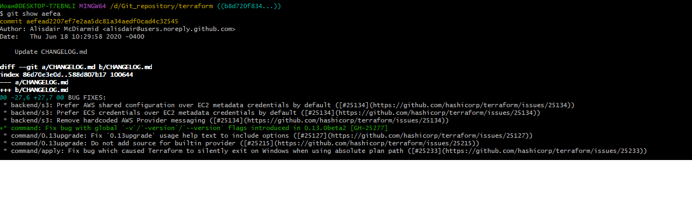
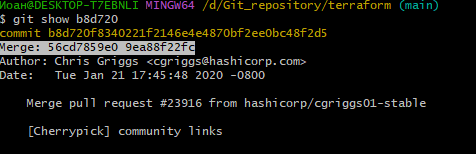
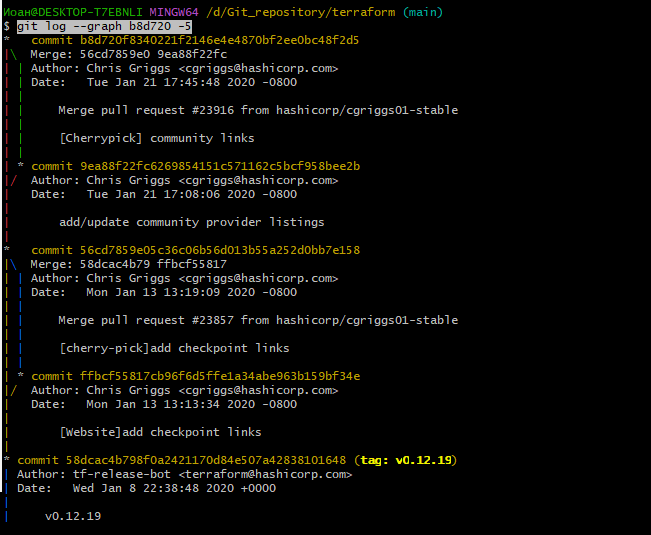
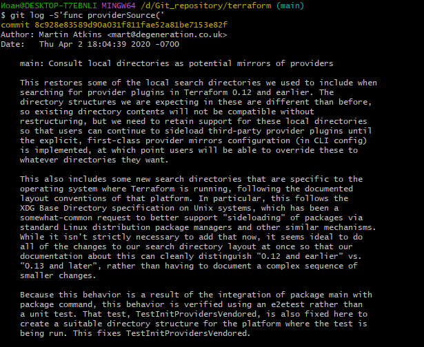
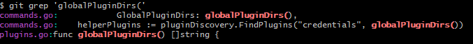
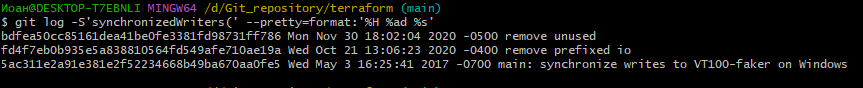

## Задание 1

Воспользовался командой git show aefea\
Полный хеш: aefead2207ef7e2aa5dc81a34aedf0cad4c32545\
Комментарий: Update CHANGELOG.md\

## Задание 2

1. git show 85024d3

tag: v0.12.23

2. git show b8d720

\
Увидел 2 хеша\
С помощью git log --graph b8d720 -5 нахожу в дереве нужные хэши\
56cd7859e05c36c06b56d013b55a252d0bb7e158\
9ea88f22fc6269854151c571162c5bcf958bee2b\
\
если бы не было 2 хеша воспользвался бы командой git show b8d720^

3. git log --pretty=oneline ^v0.12.23 v0.12.2

b14b74c4939dcab573326f4e3ee2a62e23e12f89 [Website] vmc provider links\
6ae64e247b332925b872447e9ce869657281c2bf registry: Fix panic when server is unreachable\
5c619ca1baf2e21a155fcdb4c264cc9e24a2a353 website: Remove links to the getting started guide's old location\
06275647e2b53d97d4f0a19a0fec11f6d69820b5 Update CHANGELOG.md\
d5f9411f5108260320064349b757f55c09bc4b80 command: Fix bug when using terraform login on Windows\
4b6d06cc5dcb78af637bbb19c198faff37a066ed Update CHANGELOG.md\
dd01a35078f040ca984cdd349f18d0b67e486c35 Update CHANGELOG.md\
225466bc3e5f35baa5d07197bbc079345b77525e Cleanup after v0.12.23 release

4.  git log -S'func providerSource('\
8c928e83589d90a031f811fae52a81be715e82f
\
Ищу по названию функции + открывающая скобка 

5. git grep 'globalPluginDirs(' 
Ищу все файлы в которых присутствует
\
git log --oneline  -L :globalPluginDirs:plugins.go
Ищу все изменения связанные с функцией globalPluginDirs в файле plugins.go (имя файла подразумевает нахождение там тела функции дргие файлы не смотрю)
Функция была создана в коммите 8364383c359a6b738a436d1b7745ccdce178df47
Изменения были произведены: 
66ebff90cdfaa6938f26f908c7ebad8d547fea17
41ab0aef7a0fe030e84018973a64135b11abcd70 
52dbf94834cb970b510f2fba853a5b49ad9b1a46 
78b12205587fe839f10d946ea3fdc06719decb05

6. git log -S'synchronizedWriters(' --pretty=format:'%H %an %ad %s'
Выводим коммиты где строка была добавлена или удалена первай дата 3 May 2017 
Автор: Martin Atkins
\

