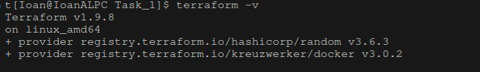
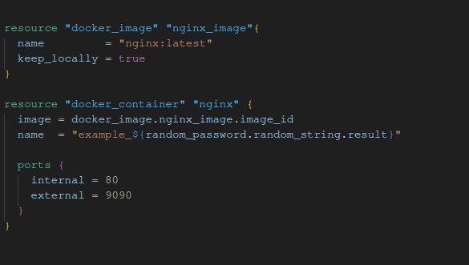
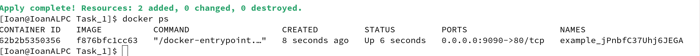
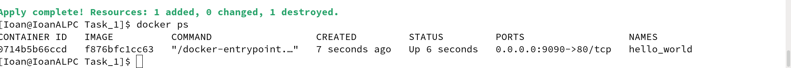
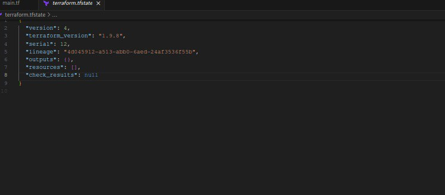

Задание 1

1. Перейдите в каталог src. Скачайте все необходимые зависимости, использованные в проекте.
2. Изучите файл .gitignore. В каком terraform-файле, согласно этому .gitignore, допустимо сохранить личную, секретную информацию?(логины,пароли,ключи,токены итд).

*.tfstate
*.tfstate.*
personal.auto.tfvars

В нашем случае в файле terraform.tfstate

3. Выполните код проекта. Найдите в state-файле секретное содержимое созданного ресурса random_password, пришлите в качестве ответа конкретный ключ и его значение.

"result": "TWR66Rgp0gky1gHM"

4. Раскомментируйте блок кода, примерно расположенный на строчках 29–42 файла main.tf. Выполните команду terraform validate. Объясните, в чём заключаются намеренно допущенные ошибки. Исправьте их.

24  resource "docker_image"                  - не объявленно локальное имя

    resource "docker_image" "nginx_image"  

29  resource "docker_container" "1nginx"     - A name must start with a letter or underscore and may contain only letters, digits, underscores, and dashes.

    resource "docker_container" "nginx"

3   name  = "example_${random_password.random_string_FAKE.resulT}"

    name  = "example_${random_password.random_string.resulT}"     - ошибка в локальном имени ресурса и ошибка в имени вложенного атрибута блока "random_string".  

5. Выполните код. В качестве ответа приложите: исправленный фрагмент кода и вывод команды docker ps.

6. Замените имя docker-контейнера в блоке кода на hello_world. Не перепутайте имя контейнера и имя образа. Мы всё ещё продолжаем использовать name = "nginx:latest". Выполните команду terraform apply -auto-approve. Объясните своими словами, в чём может быть опасность применения ключа -auto-approve. Догадайтесь или нагуглите зачем может пригодиться данный ключ? В качестве ответа дополнительно приложите вывод команды docker ps.

Выполняя terraform apply с ключем -auto-approve мы скипаем список внесенных ихменнеий что может пагубно сказаться на ресурсах инфраструктуры, например уничтожить важные данные.

7. Уничтожьте созданные ресурсы с помощью terraform. Убедитесь, что все ресурсы удалены. Приложите содержимое файла terraform.tfstate.

8. Объясните, почему при этом не был удалён docker-образ nginx:latest. Ответ ОБЯЗАТЕЛЬНО НАЙДИТЕ В ПРЕДОСТАВЛЕННОМ КОДЕ, а затем ОБЯЗАТЕЛЬНО ПОДКРЕПИТЕ строчкой из документации terraform провайдера docker. (ищите в классификаторе resource docker_image )

keep_locally = true    
If true, then the Docker image won't be deleted on destroy operation. If this is false, it will delete the image from the docker registry on destroy operation.