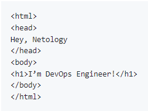
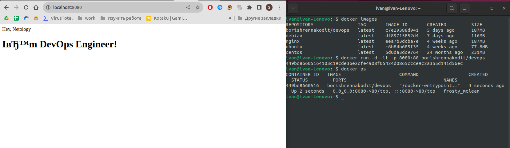
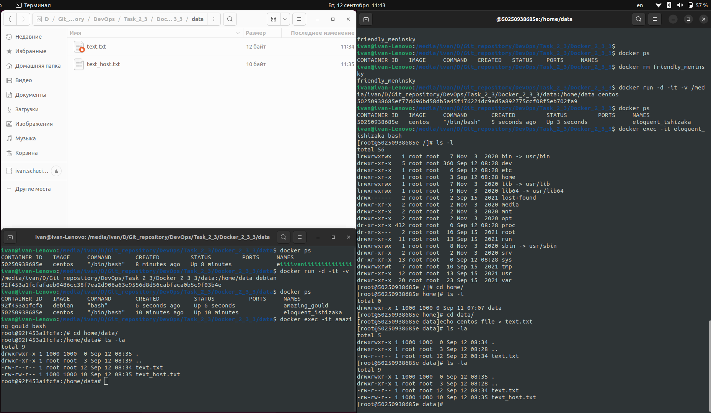

## Задание 1
#### Сценарий выполнения задачи:

создайте свой репозиторий на https://hub.docker.com;
выберите любой образ, который содержит веб-сервер Nginx;
создайте свой fork образа;
реализуйте функциональность: запуск веб-сервера в фоне с индекс-страницей, содержащей HTML-код ниже:

- https://hub.docker.com/repository/docker/borishrennakodit/devops

## Задание 2
Посмотрите на сценарий ниже и ответьте на вопрос: «Подходит ли в этом сценарии использование Docker-контейнеров или лучше подойдёт виртуальная машина, физическая машина? Может быть, возможны разные варианты?»

Детально опишите и обоснуйте свой выбор.

--

#### Сценарий:

1. высоконагруженное монолитное Java веб-приложение;
- Лучше всего подойдет физическая машина которая не будет отбирать ресурсы и предоставит все мощностя для монолитного приложения.

2. Nodejs веб-приложение;
- Приложение одно по этому подойдет и обычная виртуальная машина для упращения работы с приложением.

3. мобильное приложение c версиями для Android и iOS;
- Лучше всего подойдет Докер, он обеспечит разные среды разработки можно будет быстро поднять тестовую среду в любой момент и при необходиомсти добавить общие изменнеия. 

4. шина данных на базе Apache Kafka;
- Отлично подойдет контейнеризация ввиду обеспечения отказаустойчивости и масштабирования.

5. Elasticsearch-кластер для реализации логирования продуктивного веб-приложения — три ноды elasticsearch, два logstash и две ноды kibana;
- Данные ноды можно поднять в контейнерах и после на основе этих контейнеров запустить кластер ELK.

6. мониторинг-стек на базе Prometheus и Grafana;
-  Для быстрого доступа одного в другое они должны распологаться на 1 изолированном пространстве вполне подойдет Виртуальная машина.
Если предполагаеться быстрая развертка и универсолизация для мониторинга разных сервисов то контейнеризация поможет закрыть эти потребности.

7. MongoDB как основное хранилище данных для Java-приложения;
- У приложения должен быть быстрый доступ к данному хранилищу, само приложение должно распологаться в изолированном пространстве жёстко выделенными рессурсами, для этого подойдет Виртуальная машина

8. Gitlab-сервер для реализации CI/CD-процессов и приватный (закрытый) Docker Registry.
- Два этих сервиса должны быть расположены локально на каком-то сервере а так же они должны легко масштабироваться или быстро переразвертывация при миграции или непредвиденных ситуаций, а так же иметь отказа устойчивость, всем этим обеспечит Docker-контейнер.

## Задание 2
#### Сценарий:
- Запустите первый контейнер из образа centos c любым тегом в фоновом режиме, подключив папку /data из текущей рабочей директории на хостовой машине в /data контейнера.
- Запустите второй контейнер из образа debian в фоновом режиме, подключив папку /data из текущей рабочей директории на хостовой машине в /data контейнера.
- Подключитесь к первому контейнеру с помощью docker exec и создайте текстовый файл любого содержания в /data.
- Добавьте ещё один файл в папку /data на хостовой машине.
- Подключитесь во второй контейнер и отобразите листинг и содержание файлов в /data контейнера.

