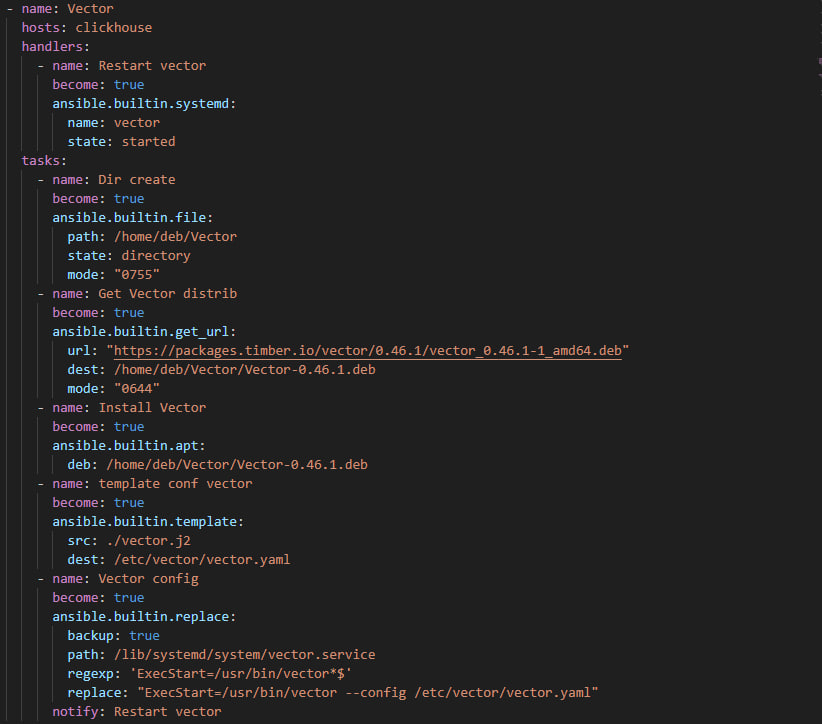
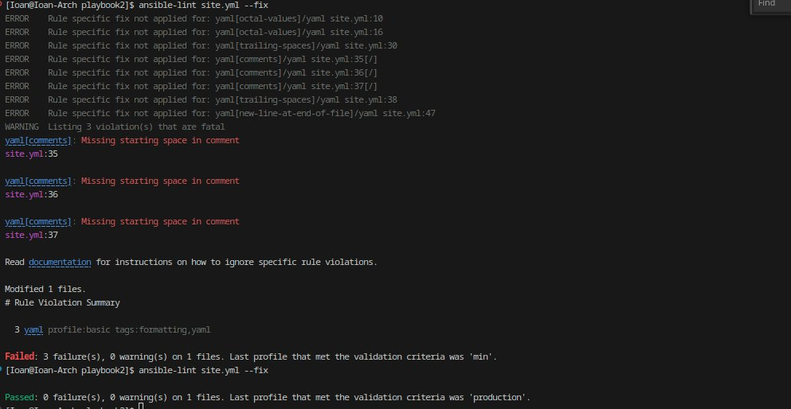
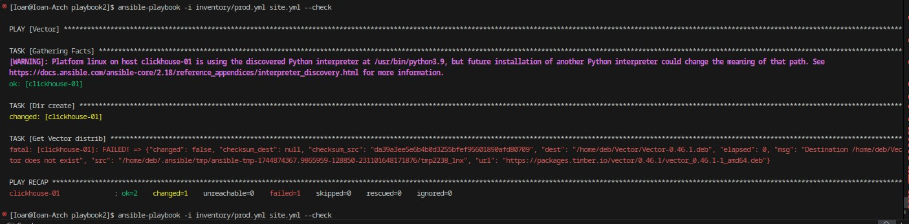
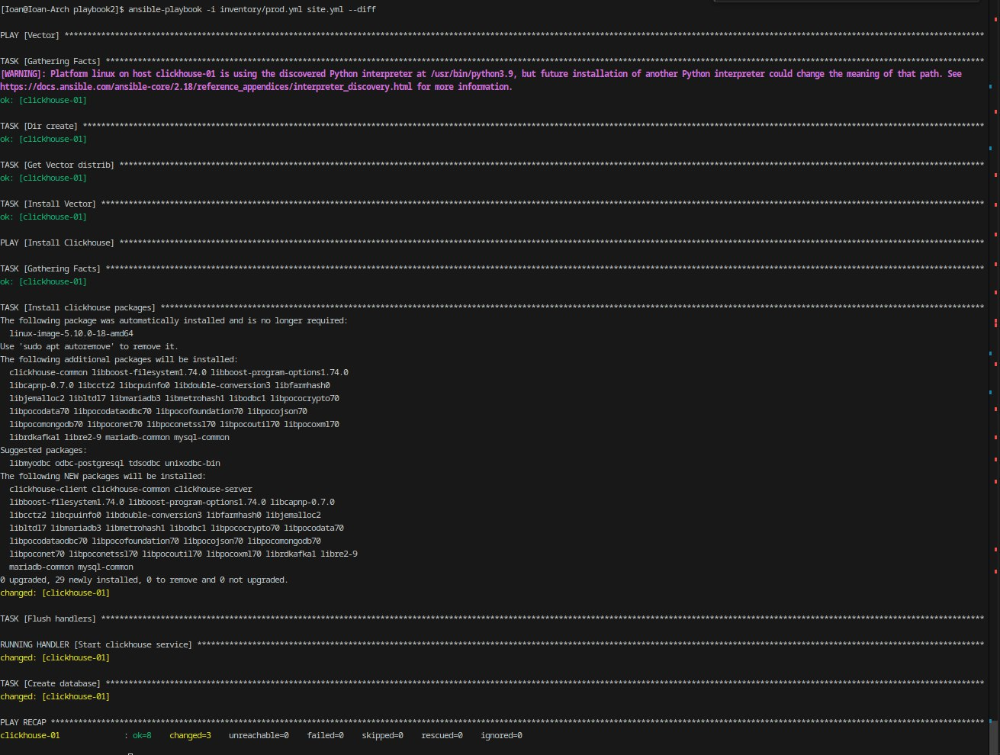
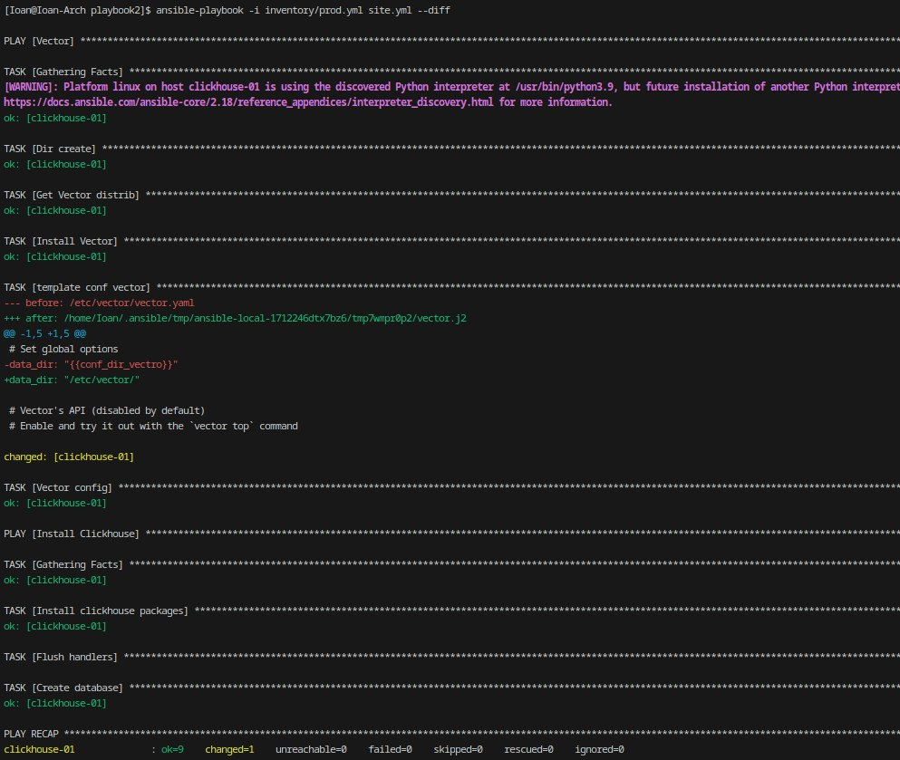
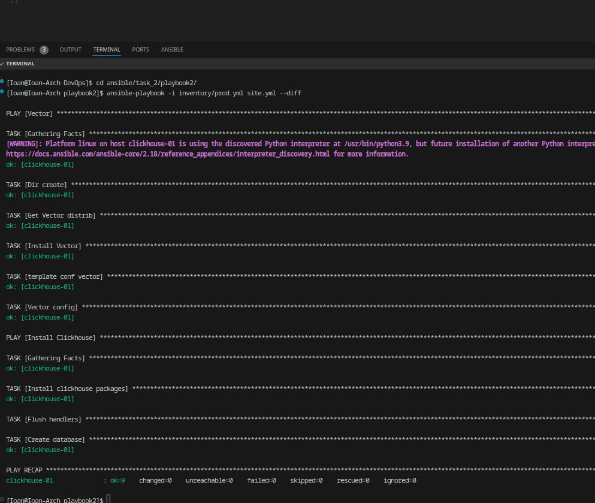
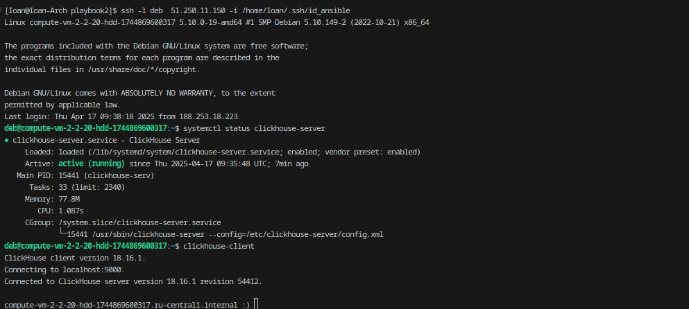

1. Подготовьте свой inventory-файл [prod.yml](./inventory/prod.yml)
2. Допишите playbook: нужно сделать ещё один play, который устанавливает и настраивает vector. Конфигурация vector должна деплоиться через template файл jinja2. От вас не требуется использовать все возможности шаблонизатора, просто вставьте стандартный конфиг в template файл. Информация по шаблонам по ссылке. не забудьте сделать handler на перезапуск vector в случае изменения конфигурации!

3. При создании tasks рекомендую использовать модули: get_url, template, unarchive, file.
   Используемые модули:
   systemd
   file
   get_url
   apt
   template
   replace
4. Tasks должны: скачать дистрибутив нужной версии, выполнить распаковку в выбранную директорию, установить vector.
5. Запустите ansible-lint site.yml и исправьте ошибки, если они есть.
   
6. Попробуйте запустить playbook на этом окружении с флагом --check.

Дистрибутив vector не скачен проверка останавливаеться на этом

7. Запустите playbook на prod.yml окружении с флагом --diff. Убедитесь, что изменения на системе произведены.

С передачей conf файла для вектор через template

8. Повторно запустите playbook с флагом --diff и убедитесь, что playbook идемпотентен.

9.  Подготовьте README.md-файл по своему playbook. В нём должно быть описано: что делает playbook, какие у него есть параметры и теги. Пример качественной документации ansible playbook по ссылке. Так же приложите скриншоты выполнения заданий №5-8
10. Готовый playbook выложите в свой репозиторий, поставьте тег 08-ansible-02-playbook на фиксирующий коммит, в ответ предоставьте ссылку на него.
    Проверка работы сервисов 
