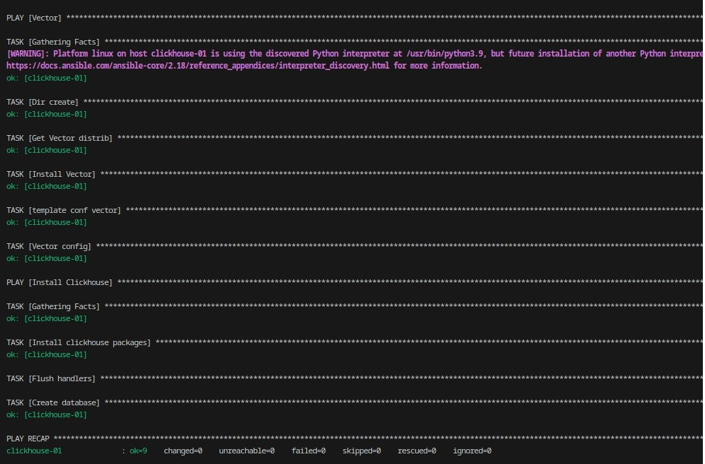
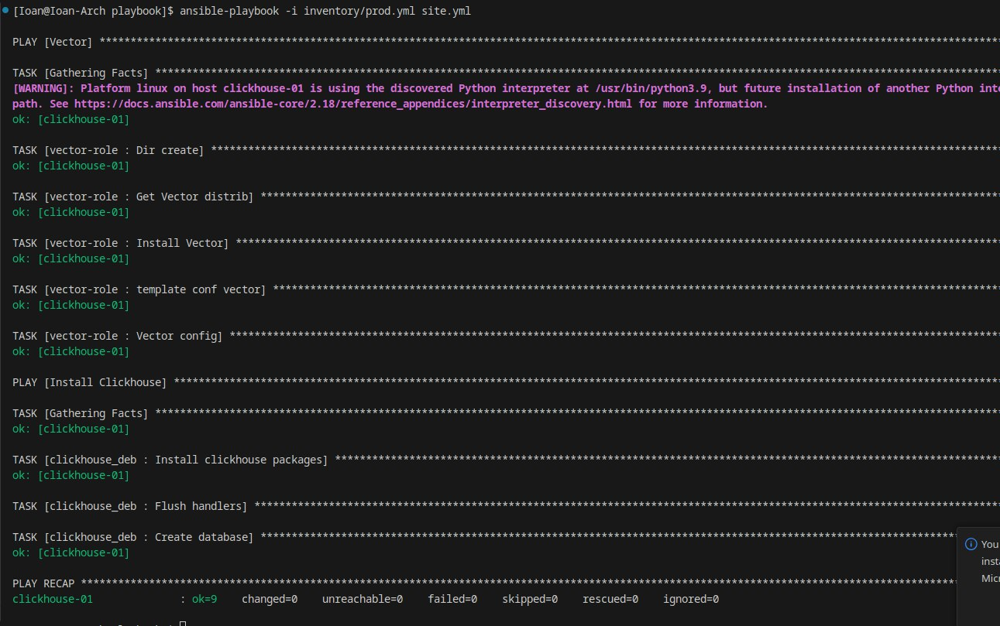
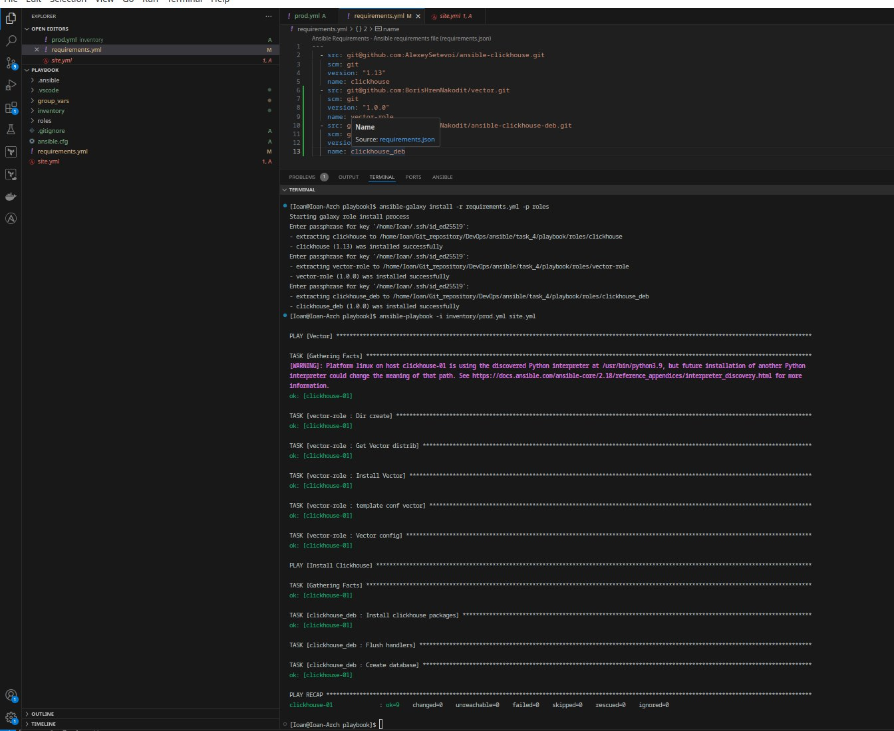

1. Создайте в старой версии playbook файл requirements.yml и заполните его содержимым:

---
  - src: git@github.com:AlexeySetevoi/ansible-clickhouse.git
    scm: git
    version: "1.13"
    name: clickhouse 
2. При помощи ansible-galaxy скачайте себе эту роль.
3. Создайте новый каталог с ролью при помощи ansible-galaxy role init vector-role.
4. На основе tasks из старого playbook заполните новую role. Разнесите переменные между vars и default.
5. Перенести нужные шаблоны конфигов в templates.
6. Опишите в README.md обе роли и их параметры. Пример качественной документации ansible role по ссылке.
7. Повторите шаги 3–6 для LightHouse. Помните, что одна роль должна настраивать один продукт.
8. Выложите все roles в репозитории. Проставьте теги, используя семантическую нумерацию. Добавьте roles в requirements.yml в playbook.
9. Переработайте playbook на использование roles. Не забудьте про зависимости LightHouse и возможности совмещения roles с tasks.
10. Выложите playbook в репозиторий.
11. В ответе дайте ссылки на оба репозитория с roles и одну ссылку на репозиторий с playbook.
### Решение 

1. Запустил конфигурацию из задания №2

2. Перенес clickhouse в role clickhouse-deb и vector в role vector-deb
3. после переноса в roles повторно запустил конфигурацию, изменений внесено не было

4. Сохранил роли в репозитории github

https://github.com/BorisHrenNakodit/vector/tree/1.0.0                 -репозиторий vector-deb
https://github.com/BorisHrenNakodit/ansible-clickhouse-deb/tree/1.0.0 -репозиторий clickhouse-deb

5. Удалили папаку roles добавил файл requirements.yml и заполнил его
6. Загрузил роли при помощи команды  ansible-galaxy 
7. Запустил повторно конфигурацию на той же машине

8. Изменений все так же не было внесено 

