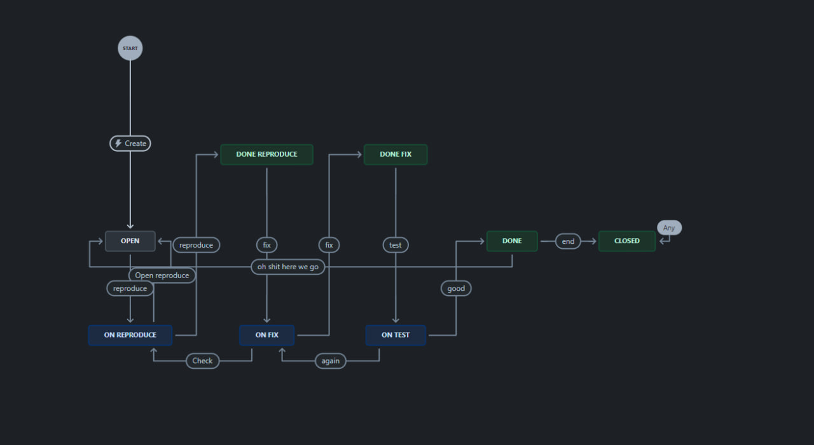
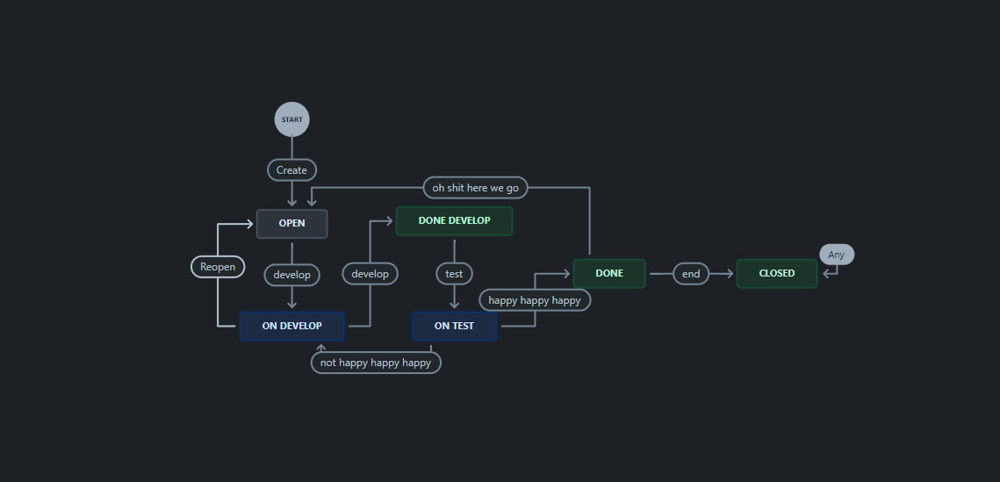
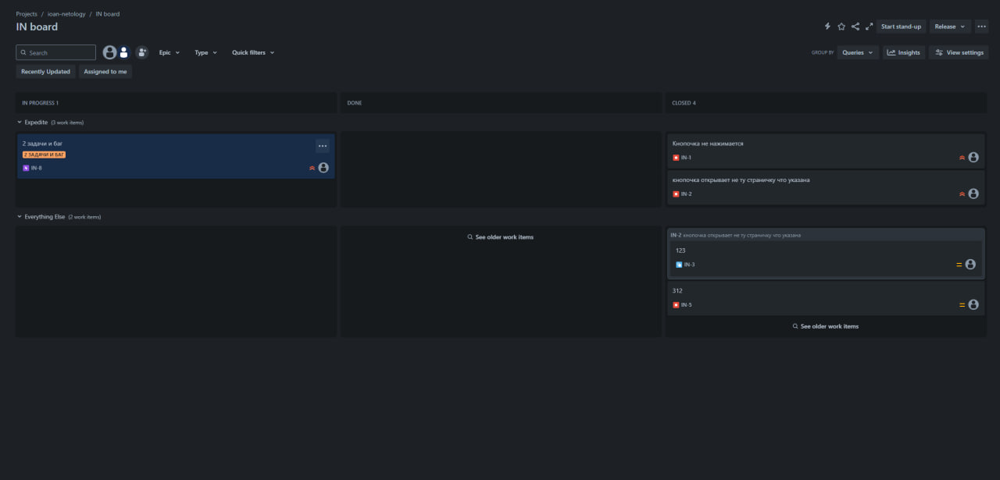
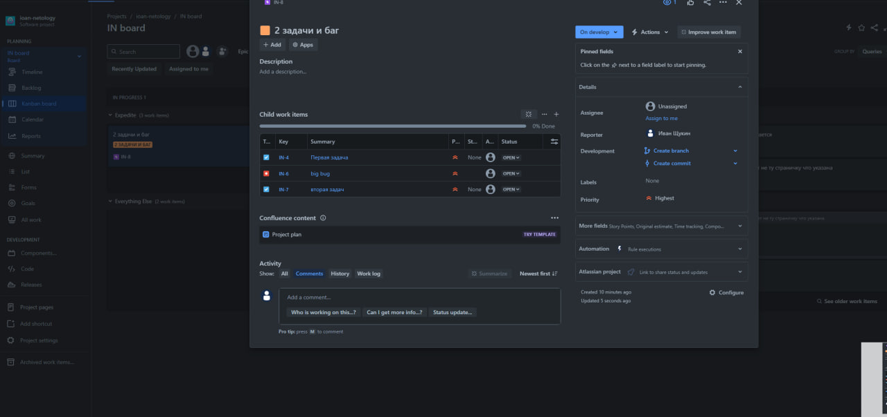
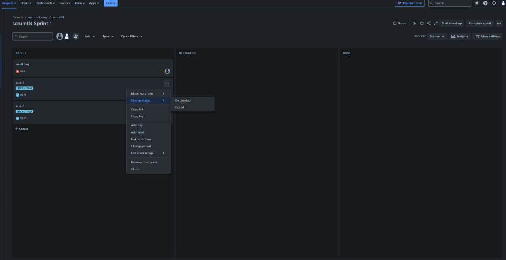
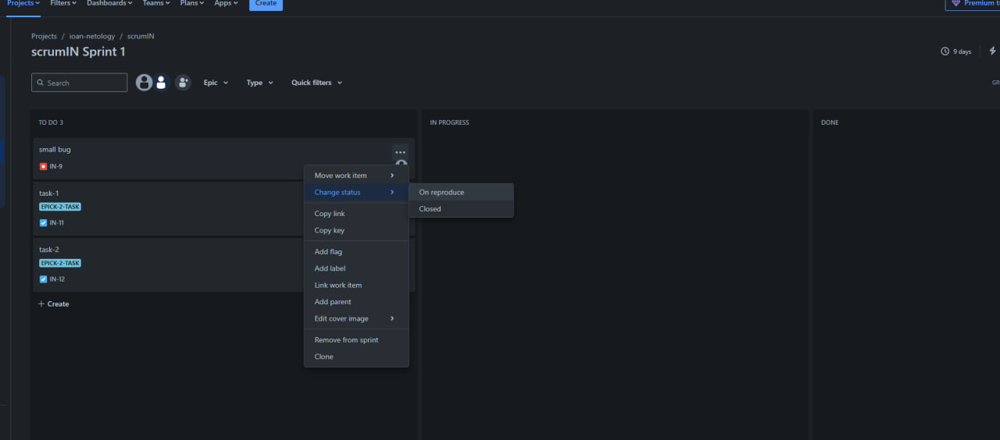
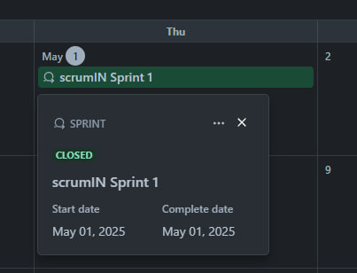

Подготовка к выполнению
Получить бесплатную версию Jira - https://www.atlassian.com/ru/software/jira/work-management/free (скопируйте ссылку в адресную строку). Вы можете воспользоваться любым(в том числе бесплатным vpn сервисом) если сайт у вас недоступен. Кроме того вы можете скачать docker образ и запустить на своем хосте self-managed версию jira.
Настроить её для своей команды разработки.
Создать доски Kanban и Scrum.
Дополнительные инструкции от разработчика Jira.
Основная часть
Необходимо создать собственные workflow для двух типов задач: bug и остальные типы задач. Задачи типа bug должны проходить жизненный цикл:

Open -> On reproduce.
On reproduce -> Open, Done reproduce.
Done reproduce -> On fix.
On fix -> On reproduce, Done fix.
Done fix -> On test.
On test -> On fix, Done.
Done -> Closed, Open.
Остальные задачи должны проходить по упрощённому workflow:

Open -> On develop.
On develop -> Open, Done develop.
Done develop -> On test.
On test -> On develop, Done.
Done -> Closed, Open.
Что нужно сделать

Создайте задачу с типом bug, попытайтесь провести его по всему workflow до Done.
Создайте задачу с типом epic, к ней привяжите несколько задач с типом task, проведите их по всему workflow до Done.
При проведении обеих задач по статусам используйте kanban.

Верните задачи в статус Open.
Перейдите в Scrum, запланируйте новый спринт, состоящий из задач эпика и одного бага, стартуйте спринт, проведите задачи до состояния Closed. Закройте спринт.

Если всё отработалось в рамках ожидания — выгрузите схемы workflow для импорта в XML. Файлы с workflow и скриншоты workflow приложите к решению задания.
[Workflow For Bug](./Workflow%20For%20Bug.xml)
[tasks](./tasks.xml)
